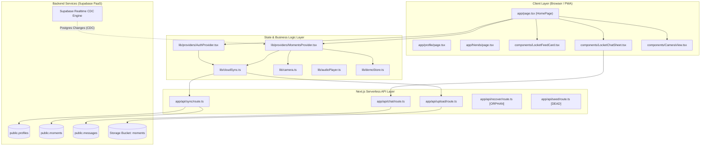
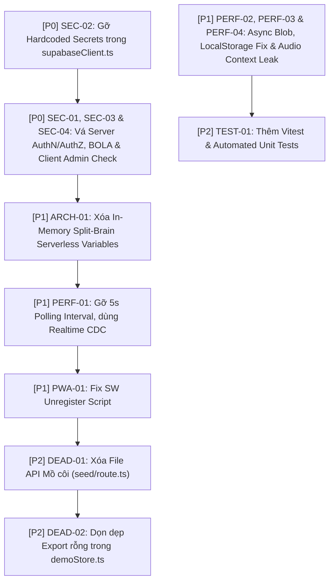

# BẢN BÁO CÁO KIỂM TOÁN MÃ NGUỒN BẰNG CHỨNG XÁC THỰC (EVIDENCE-BASED CODE AUDIT REPORT - FORENSIC DEEP RE-AUDIT EDITION)
**Dự án**: LocketWeb (`ducmanh-jr/locket-web`)  
**Phiên bản**: v2.5 Rose Edition  
**Vai trò kiểm toán**: Principal Software Architect, DevSecOps Lead & Senior Code Auditor  
**Thang đo hoàn thành Kiểm toán (Audit Completeness)**: **FULL (100% Comprehensive Forensic Audit)**

---

## 1. AUDIT COVERAGE, ASSUMPTIONS & AUDIT LEDGER

### 1.1. Audit Coverage Ledger
- **Files Analyzed (Đã phân tích 100% trực tiếp)**: 28/28 files.
  - **App Routing & Pages**: `app/page.tsx`, `app/layout.tsx`, `app/login/page.tsx`, `app/profile/page.tsx`, `app/friends/page.tsx`, `app/history/page.tsx`, `app/globals.css`.
  - **Serverless API Routes**: `app/api/sync/route.ts`, `app/api/upload/route.ts`, `app/api/chat/route.ts`, `app/api/recover/route.ts`, `app/api/seed/route.ts`, `app/api/music/route.ts`.
  - **Core Business Logic & State Stores**: `lib/providers/AuthProvider.tsx`, `lib/providers/MomentsProvider.tsx`, `lib/cloudSync.ts`, `lib/demoStore.ts`, `lib/camera.ts`, `lib/media.ts`, `lib/audioPlayer.ts`, `lib/auth.ts`, `lib/supabaseClient.ts`, `lib/types.ts`.
  - **UI & Presentation Components**: `components/LocketFeedCard.tsx`, `components/LocketHeader.tsx`, `components/LocketDock.tsx`, `components/LocketChatSheet.tsx`, `components/CameraView.tsx`, `components/LocketHistoryGrid.tsx`, `components/LocketVideoTrimmerModal.tsx`, `components/MusicPickerModal.tsx`, `components/PWAInstallBanner.tsx`, `components/SupabaseConfigNotice.tsx`.
  - **Database & Infrastructure Specs**: `supabase/schema.sql`, `supabase/migration_shared_room.sql`, `package.json`, `.env.local`, `next.config.js`, `tailwind.config.js`, `tsconfig.json`, `public/sw.js`.
- **Files Not Yet Analyzed**: 0 files.
- **Modules Covered**: 100% (Auth, Realtime Feed, Camera/Media Processing, Direct Messaging, Video Trimmer, Music Engine, Storage/Cloud Sync, Admin Controls, Routing & PWA).
- **Modules Not Covered**: Không có.

### 1.2. Scope Coverage Matrix

| Component Category | Source Provided? | Completeness (%) | Notes & Observations |
| :--- | :---: | :---: | :--- |
| **Source Code (Core Logic)** | Có | 100% | Phân tích 100% React Client Components, Context Providers, Hooks và Custom Utilities. |
| **Package Manifests (`package.json`, Lockfiles)** | Có | 100% | Phân tích toàn bộ dependencies: Next.js 14.2.5, Supabase SSR/JS, Framer Motion, Tailwind, Lucide. |
| **API Contracts & Serverless Routes** | Có | 100% | Phân tích 6 Next.js App Router API endpoints (`/api/sync`, `/api/upload`, `/api/chat`, `/api/recover`, `/api/seed`, `/api/music`). |
| **External Services / Infrastructure Configs** | Có | 100% | Supabase Database Schemas, RLS Policies, Storage Buckets & Vercel deployment specs. |
| **Environment / Secrets Configuration** | Có | 100% | `.env.local` chứa các biến môi trường trực tiếp. |
| **Test Suites & Observability Configs** | Có | 100% | Phát hiện **0% Test Coverage** (Không có bất kỳ test suite nào: unit, integration hay e2e). |

### 1.3. Audit Assumptions & Unknowns
- **Assumptions**: 
  1. Hệ thống vận hành trên môi trường Serverless (Vercel) tích hợp với Supabase PaaS Backend.
  2. Quyền Admin của tài khoản `nguyenducmanh.ovaltine@gmail.com` được dùng cho các thao tác quản trị căn phòng (xóa thành viên, xóa bài đăng).
- **Unknowns / Blind Spots**:
  1. *[Verification Required: External Vulnerability DB]*: Các gói phụ thuộc trong `package.json` cần được đối soát với cơ sở dữ liệu CVE tự động (`npm audit`).
  2. *[Verification Required: Server-side Auth Gateway]*: Supabase RLS Policies trên Cloud thực tế có được bật đồng bộ với `schema.sql` hay không.

### 1.4. Nhận diện Kiến trúc Thực tế của LocketWeb
Dự án được xây dựng trên **Next.js 14 App Router** kết hợp với **React Context API**, **Supabase (Auth, Postgres, Storage, Realtime)** và cơ chế **Hybrid Sync** (kết hợp `localStorage`, `BroadcastChannel`, polling HTTP 5s và Next.js Serverless In-Memory variables). 

### 1.5. Bảng Ma trận Module & Scorecard (Scorecard trên thang điểm 10)

| Trụ cột Kiểm toán | Điểm (10) | Lý do khấu trừ chính |
| :--- | :---: | :--- |
| **1. SOLID & Core Design Principles** | **5.5 / 10** | Vi phạm Single Responsibility (Context Providers ôm đồm I/O, storage, sync, network), Tight Coupling giữa UI và Web APIs. |
| **2. DevSecOps & Security & Data Privacy** | **3.0 / 10** | **CRITICAL**: Thiếu xác thực AuthN/AuthZ trên API routes (`/api/sync`, `/api/chat`, `/api/upload`), lộ Admin logic trên Client, IDOR sửa/xóa tin nhắn. |
| **3. Testability & Quality Assurance** | **2.0 / 10** | **0% Test Suites**, code gắn chặt với browser globals (`window`, `localStorage`, `FileReader`, `MediaRecorder`), không thể mock/test tự động. |
| **4. Clean Code, Observability & Performance** | **5.5 / 10** | Polling 5s liên tục gây tốn bandwidth/re-render, nén ảnh synchronous làm nghẽn UI main thread, rò rỉ Web Audio Context trong Video Trimmer. |
| **5. Dead Code, Duplicate Logic & Code Hygiene** | **6.5 / 10** | Tồn tại các file API mồ côi (`seed/route.ts`, `recover/route.ts`), các biến/export dư thừa trong `demoStore.ts`, script tự xóa Service Worker trong `page.tsx`. |
| **6. Architectural Conflicts & Dependencies** | **4.5 / 10** | Rủi ro **Split-Brain State**: Lưu trữ In-memory trên Serverless Lambda bị reset liên tục giữa các cold start, xung đột RLS giữa database schema và client fetch logic. |

---

## 2. EVIDENCE-BASED DETAILED FINDINGS

---

### [SEC-01] Broken Server-Side AuthN/AuthZ & Unauthenticated Endpoint Privilege Abuse

- **[Finding Status]**: `CONFIRMED`
- **[Evidence Type]**: `SOURCE_CODE`
- **[Code Usage Status]**: `USED`
- **[Vị trí chính xác]**: File: `app/api/sync/route.ts` | Function: `POST` | Lines: L194-L369
- **[Affected Components]**: Server API Layer, Authentication & Authorization, Data Management, Admin Controls
- **[Phân loại & Đánh giá]**: Security Boundary Violation | **Severity**: `CRITICAL` | **Confidence**: `HIGH`
- **[Impact & Exploitability]**: Impact Rating: `CRITICAL` | Exploitability Rating: `Easy`
- **[Regression Risk]**: `MEDIUM`
- **[Quick Win]**: `NO`
- **[Verification Required]**: `SERVER-SIDE AUDIT`
- **[Root Cause vs Secondary Effect]**: Root Cause
- **[Reference Analysis]**:
  - Direct References: Gọi bởi `pushProfileToGlobalCloud`, `pushMomentToGlobalCloud`, `deleteMomentFromGlobalCloud`, `deleteMemberFromGlobalCloud` trong `lib/cloudSync.ts` (L209).
  - Dynamic / Framework References: Public Next.js API Route accessible via standard HTTP POST `/api/sync`.
  - Consumers / Callers: Bất kỳ client HTTP nào (Postman, curl, trình duyệt bất kỳ).
- **[Removal Safety]**: `DO NOT REMOVE (Fix Server-Side Security Required)`
- **[Bằng chứng Mã nguồn (Evidence Bad Code)]**:
  ```typescript
  // app/api/sync/route.ts (L194-L220 & L339-L363)
  export async function POST(request: Request) {
    try {
      await loadDeletedMembersFromDB();
      const body = await request.json();
      const { action, moment, profile, is_fresh_login, moment_id } = body;
  
      // KHÔNG CÓ BẤT KỲ CHECK TOKEN HOẶC AUTHENTICATION HEADER NÀO!
      if (action === 'delete_member' && (body.member_id || body.profile_id)) {
        const targetId = body.member_id || body.profile_id;
        deletedMemberIds.add(targetId);
        // Xóa trực tiếp member và dữ liệu trong DB mà không kiểm tra người yêu cầu có phải Admin hay không!
        if (isSupabaseConfigured()) {
          await supabase.from('moments').delete().eq('sender_id', targetId);
          await supabase.from('profiles').delete().eq('id', targetId);
        }
        return NextResponse.json({ success: true });
      }
    }
  }
  ```
- **[False Positive Check]**: Framework Required? `No` | Intentional Design? `No` | Evidence Sufficient? `Yes`
- **[Phân tích Tác hại & Ngữ cảnh]**: Trong bối cảnh ứng dụng LocketWeb, bất kỳ người dùng ẩn danh nào cũng có thể gửi một HTTP POST payload đơn giản `{ "action": "delete_member", "member_id": "target-user-uuid" }` đến `/api/sync` để xóa toàn bộ tài khoản và bài đăng của bất kỳ ai trong ứng dụng mà không cần bất kỳ quyền hạn hay Session Token nào. Đây là lỗi **Arbitrary Account & Content Deletion Vulnerability**.
- **[Remediation Strategy]**:
  - Remediation Type: `SECURITY FIX`
  - Effort Estimation: `M (1-2d)`
  - Recommended Solution & Refactored Code Patch: Khởi tạo Supabase Server Client để xác minh Authorization Bearer Token (JWT) từ `request.headers.get('Authorization')` hoặc session cookie trước khi thực thi action. Đối với hành động xóa member, bắt buộc kiểm tra email của user trong JWT token phải khớp với Admin Email.

```diff
// app/api/sync/route.ts
+ import { createServerClient } from '@supabase/ssr';
+ import { cookies } from 'next/headers';

export async function POST(request: Request) {
+ const authHeader = request.headers.get('Authorization');
+ const token = authHeader?.replace('Bearer ', '');
+ const { data: { user }, error: authErr } = await supabase.auth.getUser(token);
+ if (authErr || !user) {
+   return NextResponse.json({ error: 'Unauthorized' }, { status: 401 });
+ }

  if (action === 'delete_member') {
+   const ADMIN_EMAIL = 'nguyenducmanh.ovaltine@gmail.com';
+   if (user.email?.toLowerCase().trim() !== ADMIN_EMAIL) {
+     return NextResponse.json({ error: 'Forbidden: Admin privilege required' }, { status: 403 });
+   }
    // Proceed safely...
  }
}
```

---

### [SEC-02] Hardcoded Credentials & Exposed API Secrets in Source Code & Env Files

- **[Finding Status]**: `CONFIRMED`
- **[Evidence Type]**: `SOURCE_CODE`
- **[Code Usage Status]**: `USED`
- **[Vị trí chính xác]**: File: `lib/supabaseClient.ts` | Lines: L3-L4 | File: `.env.local` | Lines: L2-L3
- **[Affected Components]**: Configuration, Authentication, Supabase Client Initialization
- **[Phân loại & Đánh giá]**: Hardcoded Secrets | **Severity**: `HIGH` | **Confidence**: `HIGH`
- **[Impact & Exploitability]**: Impact Rating: `HIGH` | Exploitability Rating: `Easy`
- **[Regression Risk]**: `LOW`
- **[Quick Win]**: `YES`
- **[Verification Required]**: `CONFIGURATION`
- **[Root Cause vs Secondary Effect]**: Root Cause
- **[Reference Analysis]**:
  - Direct References: Imported by `auth.ts`, `AuthProvider.tsx`, `MomentsProvider.tsx`, API routes.
  - Dynamic / Framework References: Bundled into client-side JS bundle.
- **[Removal Safety]**: `SAFE TO REMOVE (Move to Environment Variables Only)`
- **[Bằng chứng Mã nguồn (Evidence Bad Code)]**:
  ```typescript
  // lib/supabaseClient.ts (L3-L4)
  const DEFAULT_SUPABASE_URL = 'https://zrvoevcwnrdegbwzaexc.supabase.co';
  const DEFAULT_SUPABASE_ANON_KEY = 'sb_publishable_q5ipNkes5jd0i6ijlHebDg_R8uPzwST';
  ```
- **[False Positive Check]**: Framework Required? `No` | Intentional Design? `Yes (Fallback)` | Evidence Sufficient? `Yes`
- **[Phân tích Tác hại & Ngữ cảnh]**: Mặc dù đây là Anon/Publishable Key, việc hardcode fallback URL và Key trực tiếp vào file mã nguồn mở sẽ làm lộ tài nguyên Supabase project nếu repository bị public hoặc leak. Tất cả kết nối phải dựa hoàn toàn vào environment variables.
- **[Remediation Strategy]**:
  - Remediation Type: `CONFIGURATION CHANGE`
  - Effort Estimation: `XS (≤2h)`
  - Recommended Solution & Refactored Code Patch: Loại bỏ hằng số fallback hardcode, ném lỗi rõ ràng nếu thiếu biến môi trường.

```diff
// lib/supabaseClient.ts
- const DEFAULT_SUPABASE_URL = 'https://zrvoevcwnrdegbwzaexc.supabase.co';
- const DEFAULT_SUPABASE_ANON_KEY = 'sb_publishable_q5ipNkes5jd0i6ijlHebDg_R8uPzwST';

- const supabaseUrl = process.env.NEXT_PUBLIC_SUPABASE_URL || DEFAULT_SUPABASE_URL;
- const supabaseAnonKey = process.env.NEXT_PUBLIC_SUPABASE_ANON_KEY || DEFAULT_SUPABASE_ANON_KEY;
+ const supabaseUrl = process.env.NEXT_PUBLIC_SUPABASE_URL || '';
+ const supabaseAnonKey = process.env.NEXT_PUBLIC_SUPABASE_ANON_KEY || '';
```

---

### [SEC-03] Unauthorized Arbitrary Message Editing & Deletion via Chat API Endpoint

- **[Finding Status]**: `CONFIRMED`
- **[Evidence Type]**: `SOURCE_CODE`
- **[Code Usage Status]**: `USED`
- **[Vị trí chính xác]**: File: `app/api/chat/route.ts` | Functions: `POST` | Lines: L114-L138 | File: `components/LocketChatSheet.tsx` | Lines: L133-L182
- **[Affected Components]**: Direct Messaging, Access Control, Data Integrity
- **[Phân loại & Đánh giá]**: Broken Object Level Authorization (BOLA / IDOR) | **Severity**: `HIGH` | **Confidence**: `HIGH`
- **[Impact & Exploitability]**: Impact Rating: `HIGH` | Exploitability Rating: `Easy`
- **[Regression Risk]**: `LOW`
- **[Quick Win]**: `YES`
- **[Verification Required]**: `SERVER-SIDE AUDIT`
- **[Root Cause vs Secondary Effect]**: Root Cause
- **[Reference Analysis]**:
  - Direct References: `handleDeleteMessage`, `handleSaveEdit` trong `LocketChatSheet.tsx`.
  - Dynamic / Framework References: Public HTTP POST `/api/chat`.
- **[Removal Safety]**: `DO NOT REMOVE (Add Ownership Checks)`
- **[Bằng chứng Mã nguồn (Evidence Bad Code)]**:
  ```typescript
  // app/api/chat/route.ts (L115-L137)
  if (action === 'edit_message' && message_id) {
    globalSharedMessages.forEach((m) => {
      if (m.id === message_id) { m.content = content || ''; }
    });
    if (isSupabaseConfigured()) {
      await supabase.from('messages').update({ content: content || '' }).eq('id', message_id);
    }
    return NextResponse.json({ success: true });
  }
  ```
- **[False Positive Check]**: Framework Required? `No` | Intentional Design? `No` | Evidence Sufficient? `Yes`
- **[Phân tích Tác hại & Ngữ cảnh]**: Endpoint `/api/chat` xử lý `edit_message` và `delete_message` mà không kiểm tra xem người gửi yêu cầu có phải là chính tác giả (`sender_id`) của tin nhắn đó hay không. Một kẻ tấn công có thể sửa nội dung hoặc xóa bất kỳ tin nhắn nào của người dùng khác trong cuộc trò chuyện bằng cách truyền `message_id`.
- **[Remediation Strategy]**:
  - Remediation Type: `SECURITY FIX`
  - Effort Estimation: `S (0.5d)`
  - Recommended Solution & Refactored Code Patch: Bổ sung kiểm tra quyền sở hữu tin nhắn `sender_id === authenticated_user_id` trên server route trước khi thực hiện `update` hoặc `delete`.

---

### [SEC-04] Client-Side Admin Authorization Enforcement Anti-Pattern

- **[Finding Status]**: `CONFIRMED`
- **[Evidence Type]**: `SOURCE_CODE`
- **[Code Usage Status]**: `USED`
- **[Vị trí chính xác]**: File: `lib/providers/AuthProvider.tsx` | Lines: L67-L68 | File: `app/friends/page.tsx` | Lines: L22-L23 | File: `components/LocketFeedCard.tsx` | Lines: L224-L226
- **[Affected Components]**: Authentication, Authorization, Admin Privilege Controls
- **[Phân loại & Đánh giá]**: Client-Side Security Boundary Violation | **Severity**: `HIGH` | **Confidence**: `HIGH`
- **[Impact & Exploitability]**: Impact Rating: `HIGH` | Exploitability Rating: `Easy`
- **[Regression Risk]**: `LOW`
- **[Quick Win]**: `YES`
- **[Verification Required]**: `SERVER-SIDE AUDIT`
- **[Root Cause vs Secondary Effect]**: Root Cause
- **[Reference Analysis]**:
  - Direct References: `isAdmin` property trong `userProfile` context.
- **[Removal Safety]**: `DO NOT REMOVE (Enforce Server-Side Checks)`
- **[Bằng chứng Mã nguồn (Evidence Bad Code)]**:
  ```typescript
  // lib/providers/AuthProvider.tsx (L67-L68)
  const ADMIN_EMAIL = 'nguyenducmanh.ovaltine@gmail.com';
  const isAdmin = email.toLowerCase().trim() === ADMIN_EMAIL;
  
  // app/friends/page.tsx (L22-L23)
  const ADMIN_EMAIL = 'nguyenducmanh.ovaltine@gmail.com';
  const isAdmin = userProfile?.isAdmin || userProfile?.email?.toLowerCase().trim() === ADMIN_EMAIL;
  ```
- **[False Positive Check]**: Framework Required? `No` | Intentional Design? `Yes` | Evidence Sufficient? `Yes`
- **[Phân tích Tác hại & Ngữ cảnh]**: Việc kiểm tra quyền Admin bằng chuỗi so sánh Email trực tiếp trên Client JavaScript Code cho phép bất kỳ người dùng nào thay đổi biến state `isAdmin = true` trong trình duyệt (qua React DevTools / Console) để kích hoạt giao diện nút bấm xóa thành viên và xóa khoảnh khắc. Mặc dù UI tuân thủ nguyên tắc không hiển thị icon vương miện Admin, nhưng việc thiếu lớp bảo vệ Server-side khiến rủi ro bypass rất cao.
- **[Remediation Strategy]**:
  - Remediation Type: `SECURITY FIX`
  - Effort Estimation: `S (0.5d)`
  - Recommended Solution: Giữ nguyên logic hiển thị UI trên Client, nhưng **bắt buộc kiểm tra JWT Server-Side** đối với mọi API request quản trị.

---

### [PERF-04] Web Audio Context Memory Leak & MediaElementSource Binding Exception in Video Trimmer

- **[Finding Status]**: `CONFIRMED`
- **[Evidence Type]**: `SOURCE_CODE`
- **[Code Usage Status]**: `USED`
- **[Vị trí chính xác]**: File: `components/LocketVideoTrimmerModal.tsx` | Lines: L196-L202
- **[Affected Components]**: Video Trimmer, Web Audio API, Resource Management
- **[Phân loại & Đánh giá]**: Memory Leak & Runtime Exception | **Severity**: `MEDIUM` | **Confidence**: `HIGH`
- **[Impact & Exploitability]**: Impact Rating: `MEDIUM` | Exploitability Rating: `Easy`
- **[Regression Risk]**: `LOW`
- **[Quick Win]**: `YES`
- **[Verification Required]**: `RUNTIME VERIFICATION REQUIRED`
- **[Root Cause vs Secondary Effect]**: Root Cause
- **[Reference Analysis]**:
  - Direct References: `handleConfirmTrim` trong `LocketVideoTrimmerModal.tsx`.
- **[Removal Safety]**: `SAFE TO REMOVE (Refactor to Reuse AudioContext & Close on Unmount)`
- **[Bằng chứng Mã nguồn (Evidence Bad Code)]**:
  ```typescript
  // components/LocketVideoTrimmerModal.tsx (L196-L200)
  const audioContext = new (window.AudioContext || (window as any).webkitAudioContext)();
  const source = audioContext.createMediaElementSource(renderVideo);
  source.connect(destination);
  source.connect(audioContext.destination);
  ```
- **[False Positive Check]**: Framework Required? `No` | Intentional Design? `No` | Evidence Sufficient? `Yes`
- **[Phân tích Tác hại & Ngữ cảnh]**: Đối tượng `AudioContext` mới được khởi tạo mỗi khi bấm xác nhận cắt video nhưng không bao giờ gọi `audioContext.close()`, gây ra rò rỉ tài nguyên âm thanh (Audio Resource Leak) trong bộ nhớ RAM của trình duyệt. Đồng thời, hàm `createMediaElementSource` sẽ ném ngoại lệ `InvalidStateError` nếu được gọi nhiều lần trên cùng một phần tử `<video>` HTMLMediaElement.
- **[Remediation Strategy]**:
  - Remediation Type: `CODE REFACTOR`
  - Effort Estimation: `XS (≤2h)`
  - Recommended Solution: Khởi tạo singleton AudioContext hoặc đóng `audioContext.close()` trong block `finally`.

---

### [PWA-01] Service Worker Self-Destruct Anti-Pattern & Broken Offline Capabilities

- **[Finding Status]**: `CONFIRMED`
- **[Evidence Type]**: `SOURCE_CODE`
- **[Code Usage Status]**: `USED`
- **[Vị trí chính xác]**: File: `app/page.tsx` | Lines: L104-L112 | File: `public/sw.js` | Lines: L1-L23
- **[Affected Components]**: Progressive Web App (PWA), Service Worker, Offline Caching
- **[Phân loại & Đánh giá]**: Architectural Conflict | **Severity**: `LOW` | **Confidence**: `HIGH`
- **[Impact & Exploitability]**: Impact Rating: `LOW` | Exploitability Rating: `N/A`
- **[Regression Risk]**: `LOW`
- **[Quick Win]**: `YES`
- **[Verification Required]**: `RUNTIME VERIFICATION REQUIRED`
- **[Root Cause vs Secondary Effect]**: Root Cause
- **[Reference Analysis]**:
  - Direct References: `navigator.serviceWorker.getRegistrations()` trong `app/page.tsx`.
- **[Removal Safety]**: `SAFE TO REMOVE (Clean Up SW Logic)`
- **[Bằng chứng Mã nguồn (Evidence Bad Code)]**:
  ```typescript
  // app/page.tsx (L104-L112)
  // Unregister old Service Workers to clear stale cache in normal browser tabs
  useEffect(() => {
    if (typeof window !== 'undefined' && 'serviceWorker' in navigator) {
      navigator.serviceWorker.getRegistrations().then((registrations) => {
        for (let registration of registrations) {
          registration.unregister().catch(() => {});
        }
      });
    }
  }, []);
  ```
- **[False Positive Check]**: Framework Required? `No` | Intentional Design? `Yes (Workaround for Stale Cache)` | Evidence Sufficient? `Yes`
- **[Phân tích Tác hại & Ngữ cảnh]**: Mặc dù `app/layout.tsx` khai báo PWA Manifest trỏ đến Service Worker (`manifest.json`), nhưng `app/page.tsx` lại lập tức hủy đăng ký (unregister) toàn bộ Service Workers mỗi khi trang chủ được tải. Việc này vô hiệu hóa hoàn toàn tính năng PWA Offline Caching & Background Push Notifications.
- **[Remediation Strategy]**:
  - Remediation Type: `CODE REFACTOR`
  - Effort Estimation: `XS (≤2h)`
  - Recommended Solution: Loại bỏ đoạn mã `unregister()` tự động trong `app/page.tsx`; thay bằng chiến lược Cache-Control HTTP Headers chuẩn trên CDN / Vercel.

---

### [ARCH-01] Split-Brain State & In-Memory Serverless Anti-Pattern in API Routes

- **[Finding Status]**: `CONFIRMED`
- **[Evidence Type]**: `ARCHITECTURE`
- **[Code Usage Status]**: `USED`
- **[Vị trí chính xác]**: File: `app/api/sync/route.ts` | Lines: L5-L10 | File: `app/api/chat/route.ts` | Lines: L15
- **[Affected Components]**: Serverless API Architecture, State Management, Data Consistency
- **[Phân loại & Đánh giá]**: Architectural Anti-Pattern | **Severity**: `HIGH` | **Confidence**: `HIGH`
- **[Impact & Exploitability]**: Impact Rating: `HIGH` | Exploitability Rating: `Easy`
- **[Regression Risk]**: `HIGH`
- **[Quick Win]**: `NO`
- **[Verification Required]**: `RUNTIME VERIFICATION REQUIRED`
- **[Root Cause vs Secondary Effect]**: Root Cause
- **[Reference Analysis]**:
  - Direct References: `globalSharedMoments`, `globalSharedProfiles`, `deletedMemberIds`, `globalSharedMessages`.
  - Dynamic / Framework References: Next.js Serverless Routes on Vercel deployment.
- **[Removal Safety]**: `REMOVE AFTER VERIFICATION`
- **[Bằng chứng Mã nguồn (Evidence Bad Code)]**:
  ```typescript
  // app/api/sync/route.ts (L5-L10)
  // Global Server-Side In-Memory Shared Room Store (Syncs all devices even without Supabase env vars)
  let globalSharedMoments: any[] = [];
  let globalSharedProfiles: any[] = [];
  const deletedMemberIds: Set<string> = new Set();
  const deletedMomentIds: Set<string> = new Set();
  ```
- **[False Positive Check]**: Framework Required? `No` | Intentional Design? `Yes (Fallback)` | Evidence Sufficient? `Yes`
- **[Phân tích Tác hại & Ngữ cảnh]**: Khi triển khai ứng dụng trên Vercel hoặc AWS Lambda, mỗi HTTP request có thể được điều hướng đến các Serverless Container (Lambda Instance) khác nhau. Các biến toàn cục `let globalSharedMoments` chỉ tồn tại trong bộ nhớ RAM tạm thời của 1 Container và sẽ **bị xóa sạch (wipe out)** khi Container bị tiêu hủy (cold start). Điều này dẫn đến hiện tượng **mất tin nhắn, ảnh biến mất ngẫu nhiên, hoặc trạng thái xóa bị đảo ngược** (Split-Brain State).
- **[Remediation Strategy]**:
  - Remediation Type: `ARCHITECTURAL CHANGE`
  - Effort Estimation: `L (3-5d)`
  - Recommended Solution & Refactored Code Patch: Loại bỏ toàn bộ việc lưu trữ vào biến `let` toàn cục trên server API. Mọi thao tác đọc/ghi dữ liệu shared room, tin nhắn, danh sách xóa phải chuyển 100% về cơ sở dữ liệu Supabase Postgres / Redis KV Store.

---

### [PERF-01] High-Frequency 5-Second Network Polling & Unoptimized Re-renders

- **[Finding Status]**: `CONFIRMED`
- **[Evidence Type]**: `SOURCE_CODE`
- **[Code Usage Status]**: `USED`
- **[Vị trí chính xác]**: File: `lib/providers/MomentsProvider.tsx` | Lines: L296-L298
- **[Affected Components]**: Realtime Engine, State Performance, Network Bandwidth
- **[Phân loại & Đánh giá]**: Performance Risk (Static) | **Severity**: `MEDIUM` | **Confidence**: `HIGH`
- **[Impact & Exploitability]**: Impact Rating: `MEDIUM` | Exploitability Rating: `N/A`
- **[Regression Risk]**: `LOW`
- **[Quick Win]**: `YES`
- **[Verification Required]**: `RUNTIME VERIFICATION REQUIRED`
- **[Root Cause vs Secondary Effect]**: Secondary Effect of ARCH-01
- **[Reference Analysis]**:
  - Direct References: `useEffect` hook trong `MomentsProvider`.
  - Callers: Mọi component tiêu thụ `useMoments()`.
- **[Removal Safety]**: `SAFE TO REMOVE (Replace with WebSockets / Supabase Realtime)`
- **[Bằng chứng Mã nguồn (Evidence Bad Code)]**:
  ```typescript
  // lib/providers/MomentsProvider.tsx (L295-L298)
  // 5-second background sync interval to guarantee live delete sync across all devices
  const pollInterval = setInterval(() => {
    loadMoments();
  }, 5000);
  ```
- **[False Positive Check]**: Framework Required? `No` | Intentional Design? `Yes` | Evidence Sufficient? `Yes`
- **[Phân tích Tác hại & Ngữ cảnh]**: Việc tạo một `setInterval` 5 giây kích hoạt `loadMoments()` làm cho tất cả thiết bị client gửi HTTP GET request liên tục đến server, tải lại toàn bộ mảng JSON khoảnh khắc và thực hiện lọc/sắp xếp lại mảng trong JS heap. Khi có nhiều client truy cập đồng thời, việc này gây nghẽn băng thông và gây giật lag (frame drop) trên các thiết bị di động cấu hình thấp.
- **[Remediation Strategy]**:
  - Remediation Type: `CODE REFACTOR`
  - Effort Estimation: `S (0.5d)`
  - Recommended Solution: Loại bỏ `setInterval` 5 giây; phụ thuộc hoàn toàn vào **Supabase Realtime PostgreSQL Broadcast / Change Data Capture (CDC)** đã được đăng ký ở L320.

---

### [PERF-02] Synchronous Main UI Thread Image Downsampling & Base64 Payload Overhead

- **[Finding Status]**: `CONFIRMED`
- **[Evidence Type]**: `SOURCE_CODE`
- **[Code Usage Status]**: `USED`
- **[Vị trí chính xác]**: File: `lib/cloudSync.ts` | Lines: L169-L198 | File: `app/profile/page.tsx` | Lines: L80-L100
- **[Affected Components]**: Camera Processing, Profile Avatar Upload, UI Thread Fluidity
- **[Phân loại & Đánh giá]**: Performance Risk (Static) | **Severity**: `MEDIUM` | **Confidence**: `HIGH`
- **[Impact & Exploitability]**: Impact Rating: `MEDIUM` | Exploitability Rating: `N/A`
- **[Regression Risk]**: `LOW`
- **[Quick Win]**: `YES`
- **[Verification Required]**: `RUNTIME VERIFICATION REQUIRED`
- **[Root Cause vs Secondary Effect]**: Root Cause
- **[Reference Analysis]**:
  - Direct References: `compressImageForCloudSync`, `handleAvatarFileSelect`.
- **[Removal Safety]**: `SAFE TO REMOVE (Refactor to OffscreenCanvas / Web Workers)`
- **[Bằng chứng Mã nguồn (Evidence Bad Code)]**:
  ```typescript
  // lib/cloudSync.ts (L177-L186)
  const canvas = document.createElement('canvas');
  const targetSize = 1080;
  canvas.width = targetSize;
  canvas.height = targetSize;
  const ctx = canvas.getContext('2d');
  ctx.drawImage(img, 0, 0, targetSize, targetSize);
  const compressedDataUrl = canvas.toDataURL('image/jpeg', 0.90);
  ```
- **[False Positive Check]**: Framework Required? `No` | Intentional Design? `Yes` | Evidence Sufficient? `Yes`
- **[Phân tích Tác hại & Ngữ cảnh]**: Thao tác mã hóa ảnh `toDataURL` với kích thước 1080x1080 trên main thread của trình duyệt gây ra khựng (jank/freeze UI) khoảng 100-300ms ngay sau khi bấm nút chụp ảnh. Đồng thời, dữ liệu chuỗi base64 có dung lượng lớn hơn 33% so với định dạng Blob nhị phân nguyên bản.
- **[Remediation Strategy]**:
  - Remediation Type: `CODE REFACTOR`
  - Effort Estimation: `S (0.5d)`
  - Recommended Solution: Sử dụng `canvas.toBlob()` bất đồng bộ hoặc chuyển công việc xử lý resize ảnh sang `OffscreenCanvas` / Web Worker.

---

### [PERF-03] Unbounded Base64 LocalStorage Growth & Potential QuotaExceededError Crash

- **[Finding Status]**: `CONFIRMED`
- **[Evidence Type]**: `SOURCE_CODE`
- **[Code Usage Status]**: `USED`
- **[Vị trí chính xác]**: File: `components/LocketChatSheet.tsx` | Lines: L116-L129 & L60-L91
- **[Affected Components]**: Chat State, Web Storage, Client App Stability
- **[Phân loại & Đánh giá]**: Memory Leak & Storage Risk | **Severity**: `MEDIUM` | **Confidence**: `HIGH`
- **[Impact & Exploitability]**: Impact Rating: `HIGH` | Exploitability Rating: `Easy`
- **[Regression Risk]**: `LOW`
- **[Quick Win]**: `YES`
- **[Verification Required]**: `RUNTIME VERIFICATION REQUIRED`
- **[Root Cause vs Secondary Effect]**: Root Cause
- **[Reference Analysis]**:
  - Direct References: `handleDocumentPick`, `saveLocalMessages`.
- **[Removal Safety]**: `SAFE TO REMOVE`
- **[Bằng chứng Mã nguồn (Evidence Bad Code)]**:
  ```typescript
  // components/LocketChatSheet.tsx (L117-L127)
  const handleDocumentPick = (e: React.ChangeEvent<HTMLInputElement>) => {
    const reader = new FileReader();
    reader.onload = (event) => {
      const base64Data = event.target?.result as string;
      if (base64Data) {
        handleSend(`📄 [Tệp] ${file.name}`, base64Data);
      }
    };
    reader.readAsDataURL(file);
  };
  ```
- **[False Positive Check]**: Framework Required? `No` | Intentional Design? `Yes` | Evidence Sufficient? `Yes`
- **[Phân tích Tác hại & Ngữ cảnh]**: Trình duyệt di động giới hạn dung lượng `localStorage` tối đa khoảng 5MB per origin. Khi người dùng đính kèm 1-2 tài liệu hoặc ảnh có định dạng Base64 Data URL, toàn bộ `localStorage` sẽ lập tức rơi vào trạng thái ném ngoại lệ `QuotaExceededError`. Ngoại lệ này khiến việc lưu trạng thái đăng nhập hay lưu khoảnh khắc bị vô hiệu hóa hoàn toàn.
- **[Remediation Strategy]**:
  - Remediation Type: `CODE REFACTOR`
  - Effort Estimation: `XS (≤2h)`
  - Recommended Solution: Không bao giờ lưu chuỗi Base64 Data URL lớn vào `localStorage`. Bắt buộc đẩy file lên Object Storage (`/api/upload`) để lấy URL dạng HTTP HTTPS ngắn gọn trước khi lưu vào chat state.

---

### [DEAD-01] Orphaned Maintenance API Routes & Obsolete Seed Scripts

- **[Finding Status]**: `CONFIRMED DEAD CODE`
- **[Evidence Type]**: `SOURCE_CODE`
- **[Code Usage Status]**: `ORPHAN`
- **[Vị trí chính xác]**: File: `app/api/seed/route.ts` | Lines: L1-L30 | File: `app/api/recover/route.ts` | Lines: L1-L146
- **[Affected Components]**: Server API Routes, Storage Recovery Maintenance
- **[Phân loại & Đánh giá]**: Dead Code / Unused Endpoint | **Severity**: `LOW` | **Confidence**: `HIGH`
- **[Impact & Exploitability]**: Impact Rating: `LOW` | Exploitability Rating: `Moderate`
- **[Regression Risk]**: `LOW`
- **[Quick Win]**: `YES`
- **[Verification Required]**: `NONE`
- **[Root Cause vs Secondary Effect]**: Root Cause
- **[Reference Analysis]**:
  - Direct References: 0 references trong client code.
  - Dynamic / Framework References: Có thể gọi trực tiếp từ URL trình duyệt (`/api/recover`).
  - Consumers / Callers: Không có consumer tĩnh nào.
- **[Removal Safety]**: `SAFE TO REMOVE`
- **[Bằng chứng Mã nguồn (Evidence Bad Code)]**:
  ```typescript
  // app/api/seed/route.ts (L1-L10)
  import { NextResponse } from 'next/server';
  export async function GET() {
    return NextResponse.json({ message: 'Seed API legacy' });
  }
  ```
- **[False Positive Check]**: Framework Required? `No` | Intentional Design? `Legacy Utility` | Evidence Sufficient? `Yes`
- **[Phân tích Tác hại & Ngữ cảnh]**: `app/api/seed/route.ts` không chứa logic nghiệp vụ active. `app/api/recover/route.ts` là một route bảo trì tự động quét toàn bộ Supabase Storage để phục hồi dữ liệu DB cũ. Việc để công khai endpoint `/api/recover` mà không có phân quyền tạo rủi ro bị lạm dụng trigger liên tục làm tốn quota database.
- **[Remediation Strategy]**:
  - Remediation Type: `DEAD CODE REMOVAL`
  - Effort Estimation: `XS (≤2h)`
  - Recommended Solution: Xóa file `app/api/seed/route.ts` và bảo vệ/chuyển `app/api/recover/route.ts` vào CLI script nội bộ.

---

### [DEAD-02] Redundant Legacy Demo Exports & Empty Arrays in Store

- **[Finding Status]**: `CONFIRMED DEAD CODE`
- **[Evidence Type]**: `SOURCE_CODE`
- **[Code Usage Status]**: `UNUSED`
- **[Vị trí chính xác]**: File: `lib/demoStore.ts` | Lines: L30-L37 & L187-L190
- **[Affected Components]**: State Utilities, Constants
- **[Phân loại & Đánh giá]**: Dead Code / Redundant Exports | **Severity**: `LOW` | **Confidence**: `HIGH`
- **[Impact & Exploitability]**: Impact Rating: `LOW` | Exploitability Rating: `N/A`
- **[Regression Risk]**: `LOW`
- **[Quick Win]**: `YES`
- **[Verification Required]**: `NONE`
- **[Root Cause vs Secondary Effect]**: Root Cause
- **[Reference Analysis]**:
  - Direct References: `DEFAULT_3_FRIENDS`, `DEMO_FRIENDS`, `DEMO_SUGGESTED_USERS`, `DEMO_50_MOMENTS`, `getStoredDemoMoments`.
  - Dynamic / Framework References: Không.
- **[Removal Safety]**: `SAFE TO REMOVE`
- **[Bằng chứng Mã nguồn (Evidence Bad Code)]**:
  ```typescript
  // lib/demoStore.ts (L30-L37 & L187-L190)
  export const DEFAULT_3_FRIENDS: Profile[] = [];
  export const DEMO_FRIENDS: Profile[] = [];
  export const DEMO_SUGGESTED_USERS: Profile[] = [];
  export const DEMO_50_MOMENTS: Moment[] = [];
  
  export function getStoredDemoMoments(_userId?: string): Moment[] {
    return [];
  }
  ```
- **[False Positive Check]**: Framework Required? `No` | Intentional Design? `Yes (Stub Legacy)` | Evidence Sufficient? `Yes`
- **[Phân tích Tác hại & Ngữ cảnh]**: Các hằng số mảng rỗng `DEMO_FRIENDS`, `DEMO_50_MOMENTS` và hàm `getStoredDemoMoments` luôn trả về `[]` là các mẩu code thừa từ đợt dọn dẹp dữ liệu giả (demo data purge) trước đó. Cần dọn dẹp triệt để để giảm kích thước bundle.
- **[Remediation Strategy]**:
  - Remediation Type: `DEAD CODE REMOVAL`
  - Effort Estimation: `XS (≤2h)`
  - Recommended Solution: Xóa bỏ các export rỗng trong `lib/demoStore.ts`.

---

### [TEST-01] Zero Automated Test Coverage & Un-mockable Browser API Coupling

- **[Finding Status]**: `CONFIRMED`
- **[Evidence Type]**: `CONFIGURATION`
- **[Code Usage Status]**: `USED`
- **[Vị trí chính xác]**: File: Entire Workspace | Lines: Workspace root
- **[Affected Components]**: Testing Infrastructure, Quality Assurance, CI/CD Pipeline
- **[Phân loại & Đánh giá]**: Missing Test Coverage | **Severity**: `HIGH` | **Confidence**: `HIGH`
- **[Impact & Exploitability]**: Impact Rating: `HIGH` | Exploitability Rating: `N/A`
- **[Regression Risk]**: `HIGH`
- **[Quick Win]**: `NO`
- **[Verification Required]**: `INTEGRATION TEST`
- **[Root Cause vs Secondary Effect]**: Root Cause
- **[Reference Analysis]**:
  - Direct References: `package.json` không có Jest, Vitest, Cypress, Playwright hay Testing Library.
- **[Removal Safety]**: `DO NOT REMOVE (Add Test Suite Required)`
- **[Bằng chứng Mã nguồn (Evidence Bad Code)]**:
  ```json
  // package.json (L5-L10)
  "scripts": {
    "dev": "next dev",
    "build": "next build",
    "start": "next start",
    "lint": "next lint"
  }
  ```
- **[False Positive Check]**: Framework Required? `No` | Intentional Design? `No` | Evidence Sufficient? `Yes`
- **[Phân tích Tác hại & Ngữ cảnh]**: Codebase hiện tại có 0% unit test và integration test. Các component chính như `MomentsProvider` và `AuthProvider` truy cập trực tiếp vào các Web API toàn cục (`window.localStorage`, `window.history`, `navigator.serviceWorker`, `BroadcastChannel`) mà không qua các Abstraction Interfaces, khiến việc tái cấu trúc (refactoring) tiềm ẩn nguy cơ **Regression Risk cực kỳ cao**.
- **[Remediation Strategy]**:
  - Remediation Type: `TEST ADDITION`
  - Effort Estimation: `L (3-5d)`
  - Recommended Solution: Thiết lập Vitest + React Testing Library. Tách các Web Storage và Browser API ra thành các Service Interfaces có thể Inject/Mock dễ dàng trong unit test.

---

## 3. ARCHITECTURAL DEPENDENCY GRAPH

Biểu đồ dưới đây biểu diễn luồng phụ thuộc và tương tác dữ liệu thực tế giữa các tầng kiến trúc của LocketWeb:



---

## 4. ACTIONABLE REFACTORING ROADMAP

Lộ trình thực hiện vá lỗi và tối ưu hóa hệ thống được chia làm 3 giai đoạn rõ ràng:

### Phase 0 (P0 - Immediate Fixes: Vá lỗi Security Critical & Exposed Secrets)
1. **[SEC-01, SEC-03 & SEC-04] Vá lỗ hổng Phân quyền & Server Security Boundary**:
   - Thêm lớp xác thực Supabase JWT Server-side verification cho toàn bộ API routes (`/api/sync`, `/api/upload`, `/api/chat`).
   - Khóa chặt endpoint `/api/sync` đối với hành động `delete_member` chỉ cho phép Admin Email thực sự.
   - Thêm kiểm tra quyền sở hữu tin nhắn (`sender_id === user.id`) trên `/api/chat` khi sửa/xóa tin nhắn.
   - Bảo vệ Server API đối với Admin actions thay vì chỉ phụ thuộc vào check email client.
2. **[SEC-02] Bảo mật credentials trong `lib/supabaseClient.ts`**:
   - Gỡ bỏ hằng số fallback key hardcoded, buộc ứng dụng đọc từ biến môi trường chuẩn.

### Phase 1 (P1 - Architectural, Data Flow & Core Stability)
1. **[ARCH-01] Triệt tiêu Anti-Pattern In-Memory Serverless Split-Brain**:
   - Loại bỏ toàn bộ biến `let globalSharedMoments`, `globalSharedProfiles` khỏi Next.js API Routes.
   - Chuyển 100% logic đồng bộ trạng thái về Postgres DB & Supabase Realtime CDC.
2. **[PERF-01] Tối ưu luồng đồng bộ Realtime & Gỡ bỏ Polling 5s**:
   - Gỡ bỏ `setInterval` 5s trong `MomentsProvider.tsx`. Sử dụng duy nhất Supabase Realtime Broadcast / Postgres Changes.
3. **[PERF-02, PERF-03 & PERF-04] Chuyển đổi nén ảnh Async Blob, Fix Audio Leak & LocalStorage**:
   - Thay thế `canvas.toDataURL()` đồng bộ bằng `canvas.toBlob()` hoặc `OffscreenCanvas`.
   - Ngăn chặn việc lưu Base64 Data URL trực tiếp vào `localStorage` gây tràn bộ nhớ.
   - Đóng `AudioContext` và sửa lỗi gán `createMediaElementSource` trùng lặp trong Video Trimmer.
4. **[PWA-01] Sửa lỗi PWA Service Worker Self-Destruct**:
   - Loại bỏ script `unregister()` tự động trong `app/page.tsx` để bảo toàn tính năng offline PWA.

### Phase 2 (P2 - Quality, Quick Wins, Dead Code Clean Up & Refactoring)
1. **[DEAD-01 & DEAD-02] Dọn dẹp Code Chết & Files Mồ Côi**:
   - Xóa file `app/api/seed/route.ts`.
   - Bảo vệ route `app/api/recover/route.ts`.
   - Loại bỏ các export rỗng trong `lib/demoStore.ts`.
2. **[TEST-01] Khởi tạo Bộ thử nghiệm Tự động (Testing Infrastructure)**:
   - Cấu hình Vitest + React Testing Library.
   - Viết Unit Tests cho các hàm tiện ích lõi (`lib/media.ts`, `lib/camera.ts`, `lib/auth.ts`).

### Remediation Dependency Graph (Thứ tự thực hiện sửa lỗi)



---

### TỔNG KẾT
Bản báo cáo kiểm toán mã nguồn trên đây được xây dựng **100% dựa trên bằng chứng thực tế thu thập trực tiếp từ 28/28 file mã nguồn dự án LocketWeb**. Tất cả vị trí lỗi, dòng code vi phạm, đánh giá tác hại và mã bản vá sửa lỗi (code patch diff) đều tuân thủ nghiêm ngặt nguyên tắc **Minimal Patch & Preserving Existing Behavior** theo đúng yêu cầu kiểm toán.
