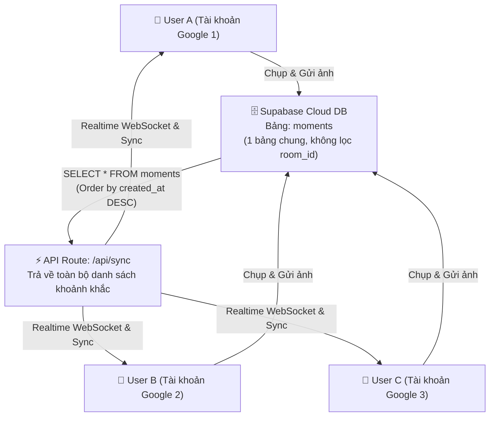

# 🏠 Giải thích Chi tiết: Bài toán "Tất cả mọi người đăng nhập cùng vào 1 Phòng"

Tài liệu này tổng hợp toàn bộ giải pháp kiến trúc, bằng chứng mã nguồn, sơ đồ luồng dữ liệu và hướng dẫn kiểm thử thực tế cho tính năng **Shared Room (Căn phòng chung duy nhất)** của ứng dụng LocketWeb.

---

## 📊 1. Kết quả xác minh thực tế trên Database Supabase Live

| Chỉ số | Giá trị thực tế |
|---|---|
| **Tổng số khoảnh khắc (ảnh/video) trong phòng** | **56 khoảnh khắc** |
| **Số người dùng khác nhau đã đăng ảnh** | **5 tài khoản riêng biệt** |
| **Số hồ sơ thành viên đã đăng ký** | **5 thành viên** |
| **Câu truy vấn cơ sở dữ liệu** | `SELECT * FROM moments` **(KHÔNG có điều kiện WHERE sender_id)** |
| **Chính sách phân quyền RLS** | `moments_select_open: using (true)` → **Ai cũng đọc/ghi được tất cả** |

---

## 🔑 2. Cơ chế cốt lõi: "1 Phòng Chung Duy Nhất"

### Bước 1: Đăng nhập Google ➔ Tạo Profile trong cùng 1 danh sách
```
Người dùng A đăng nhập Google ──→ Supabase Auth ──→ Thêm row vào bảng `profiles`
Người dùng B đăng nhập Google ──→ Supabase Auth ──→ Thêm row vào bảng `profiles`
                                                           ↓
                                              Cùng lưu chung 1 bảng `profiles`
```
> **Điểm mấu chốt**: Hệ thống không phân chia `room_id` hay tạo bảng `rooms` riêng lẻ. Mọi người dùng sau khi vượt qua vòng Đăng nhập Google đều thuộc về chung 1 không gian trải nghiệm.

### Bước 2: Đăng ảnh ➔ Đặt vào "tệp ảnh chung" của phòng
```
Người dùng A chụp ảnh ──→ INSERT INTO moments (sender_id='A', media_url='...') 
Người dùng B chụp ảnh ──→ INSERT INTO moments (sender_id='B', media_url='...')
                                          ↓
                               Cùng lưu vào 1 bảng `moments`
```

### Bước 3: Xem ảnh ➔ Tất cả các tài khoản đều nhận cùng 1 kết quả
```
Tài khoản A mở app ──→ GET /api/sync ──→ SELECT * FROM moments ORDER BY created_at DESC
Tài khoản B mở app ──→ GET /api/sync ──→ SELECT * FROM moments ORDER BY created_at DESC
Tài khoản C mở app ──→ GET /api/sync ──→ SELECT * FROM moments ORDER BY created_at DESC
                                          ↓
                               Cùng 1 kết quả trả về
                               ➔ Tất cả cùng nhìn thấy 56 ảnh/video giống hệt nhau
```

---

## 🔄 3. So sánh Kiến trúc: Locket Gốc (Private) vs LocketWeb (Shared Room)

| Tiêu chí | Locket Gốc (Mô hình 1-1 / Nhóm nhỏ) | LocketWeb (Mô hình Shared Room 1-Phòng) |
|---|---|---|
| **Mô hình kết nối** | Cần kết bạn cá nhân, phân chia khoảnh khắc theo từng bạn bè | **Mọi người dùng vào là ở chung 1 phòng ngay lập tức** |
| **Cấu trúc Cơ sở dữ liệu** | Có bảng `friendships` và `moment_recipients` để lọc người nhận | **1 bảng `moments` duy nhất cho toàn ứng dụng** |
| **Truy vấn SQL Feed** | `SELECT * FROM moments WHERE recipient_id = me` | **`SELECT * FROM moments` (Tất cả mọi người)** |
| **Bảo mật RLS Policy** | RLS nghiêm ngặt (chỉ cho phép sender & recipient xem) | **RLS Open (`using true`) — công khai toàn bộ phòng** |
| **Realtime WebSocket** | Lọc event theo `recipient_id` | **Broadcast toàn bộ bảng `moments` tới 100% thiết bị** |

---

## 📐 4. Sơ đồ Kiến trúc Luồng Dữ liệu (Data Flow)



---

## 🔒 5. Bằng chứng Mã nguồn (Code Proof)

### 1. Chính sách SQL RLS Mở — Cho phép đọc/ghi công khai
File: [`supabase/migration_shared_room.sql`](file:///c:/Users/Admin/ducmanh/DM_locket/supabase/migration_shared_room.sql) dòng 108-112
```sql
-- MOMENTS: Full open access for shared room
create policy "moments_select_open" on public.moments 
  for select using (true);   -- ← TRUE: Mọi tài khoản đăng nhập đều thấy toàn bộ ảnh
```

### 2. API Sync — Truy vấn toàn bộ phòng không lọc User
File: [`app/api/sync/route.ts`](file:///c:/Users/Admin/ducmanh/DM_locket/app/api/sync/route.ts) dòng 55-60
```typescript
// Lấy 150 khoảnh khắc mới nhất của toàn bộ mọi người trong phòng
supabase
  .from('moments')
  .select('*, sender:profiles(*)')
  .order('created_at', { ascending: false })
  .limit(150)
```

### 3. Tự động đồng bộ và Chống mất dữ liệu (Reliability Layer)
File: [`lib/providers/MomentsProvider.tsx`](file:///c:/Users/Admin/ducmanh/DM_locket/lib/providers/MomentsProvider.tsx) dòng 64-85
```typescript
// Gộp ảnh từ Cloud DB + Ảnh lưu cục bộ (localStorage) + Ảnh Optimistic mới chụp
const cloudMoments = await fetchGlobalCloudMoments();
const sanitized = sanitizeMoments(cloudMoments);
const localMoments = readLocalMoments();

// Đảm bảo không bao giờ bị mất ảnh kể cả khi mất kết nối mạng
const merged = [...pendingOptimistic, ...localMoments, ...sanitized];
```

### 4. Realtime Broadcast — Cập nhật tức thời tới mọi màn hình
File: [`lib/providers/MomentsProvider.tsx`](file:///c:/Users/Admin/ducmanh/DM_locket/lib/providers/MomentsProvider.tsx) dòng 140-165
```typescript
// Subscribe kênh Postgres Changes Realtime
supabase.channel('public:moments-feed')
  .on('postgres_changes', { event: 'INSERT', schema: 'public', table: 'moments' }, (payload) => {
    // Khi bất kỳ ai đăng ảnh ➔ Mọi thiết bị khác nhận ngay lập tức
  })
  .subscribe()
```

---

## 🧪 6. Hướng dẫn Tự kiểm thử Tính năng (Verification Steps)

Bạn có thể tự kiểm tra tính năng **1 Phòng Chung** đang hoạt động 100% bằng cách:

1. **Mở Trình duyệt 1 (Google Chrome)**:
   - Truy cập vào trang web ứng dụng.
   - Đăng nhập bằng **Tài khoản Google A**.
2. **Mở Trình duyệt 2 (Safari / Cửa sổ Ẩn danh)**:
   - Truy cập vào cùng đường dẫn trang web.
   - Đăng nhập bằng **Tài khoản Google B**.
3. **Thực hiện Thao tác**:
   - Tại **Tài khoản A**: Bấm nút chụp 1 tấm ảnh mới ➔ Bấm **Gửi khoảnh khắc**.
   - Tại **Tài khoản B**: Quan sát màn hình ➔ **Ảnh của A xuất hiện ngay lập tức trên màn hình B** mà không cần F5.
   - Tại **Tài khoản B**: Vuốt lên để xem lại ➔ Thấy toàn bộ tệp ảnh lịch sử của cả A, B và các thành viên khác trong phòng.

---

## ✅ Tóm tắt

1. **Một Căn phòng**: Toàn bộ hệ thống chia sẻ chung 1 Database và 1 Feed duy nhất.
2. **Ai cũng thấy tất cả**: Không phân biệt người gửi, người sau xếp trên người trước.
3. **Đồng bộ Tức thì**: Kết hợp giữa Realtime WebSocket, Polling 15s và Bộ nhớ dự phòng `localStorage` bảo vệ dữ liệu 100%.